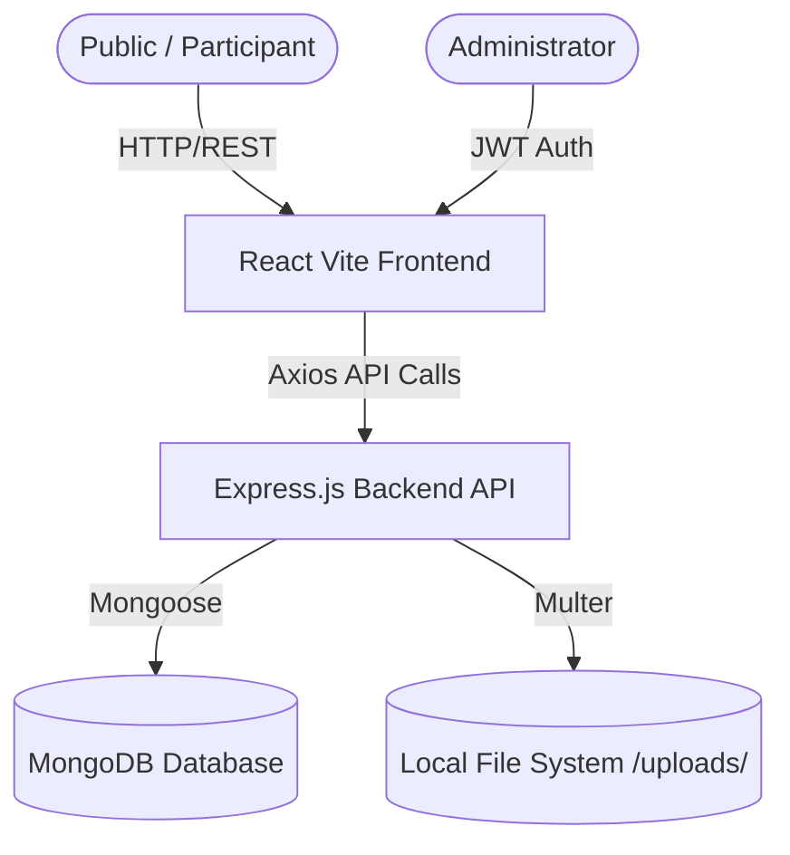
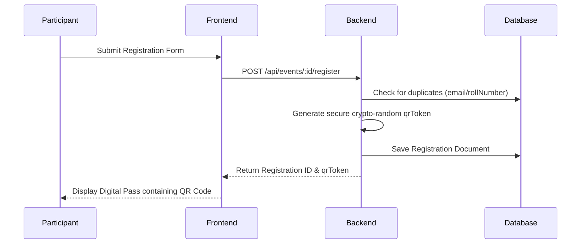
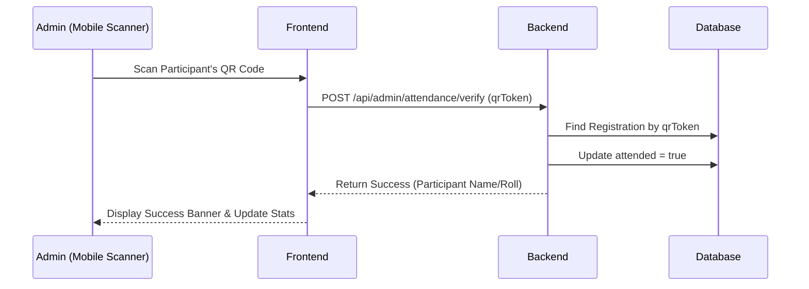

# System Architecture

## Overview
The ENIGMA platform is built on a standard MERN (MongoDB, Express, React, Node.js) stack. It follows a client-server architecture where the Vite-bundled React frontend communicates with the Express backend via RESTful APIs.

## Conceptual Flow

## Frontend Architecture
The frontend is built using React and Vite. It heavily relies on `React Router DOM` for navigation.
- **Pages**: Top-level components representing distinct views (e.g., `Home.jsx`, `Events.jsx`, `AdminLayout.jsx`).
- **Components**: Reusable UI blocks (e.g., `SectionHeader.jsx`, `EventCard.jsx`).
- **Context API**: Global state management, primarily used for `AuthContext` to manage the administrator's JWT session state.
- **API Helper**: An `axios` instance configured in `api.js` automatically attaches credentials (cookies) to all backend requests.

## Backend Architecture
The backend is an Express.js server functioning as a JSON API.
- **Routes**: Separated into public endpoints (`api.js`) and protected CMS endpoints (`admin.js`).
- **Middleware**: 
  - `adminAuth`: Verifies the `adminToken` JWT cookie for protected routes.
  - `multer`: Intercepts `multipart/form-data` requests to save images locally into `/uploads/`.
- **Database**: Mongoose models strictly define the schemas for `Event`, `TeamMember`, `Project`, `Achievement`, and `Registration`.

## Registration & QR Flow

## Attendance Verification Flow

## Authentication Flow
The system uses a hardcoded admin credential model via `.env`.
1. Admin submits username/password.
2. Backend compares password against `ADMIN_PASSWORD_HASH` using `bcrypt`.
3. Backend signs a JWT and sets an `HttpOnly`, `Secure` cookie named `adminToken`.
4. The frontend reads `admin` state and permits access to CMS routes.

## Storage Architecture
Currently, images (member photos, event posters) are handled via local filesystem storage using `multer`.
- **Upload**: `POST /api/admin/...` uses `upload.any()` or `upload.single()`. Images are saved to `backend/uploads/`.
- **Retrieval**: The backend serves the `uploads/` directory statically (`express.static`). The frontend constructs the absolute URL (e.g., `http://localhost:5000/uploads/file.png`).
